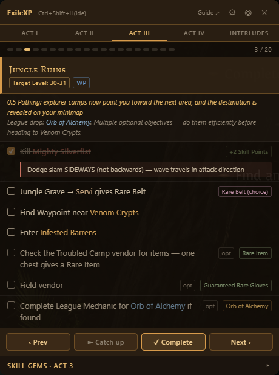
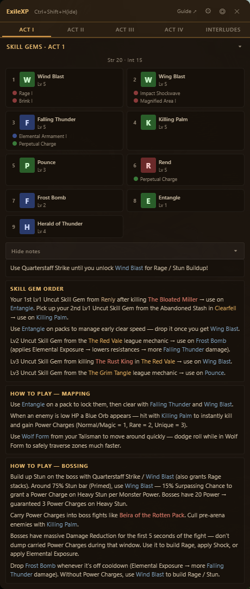
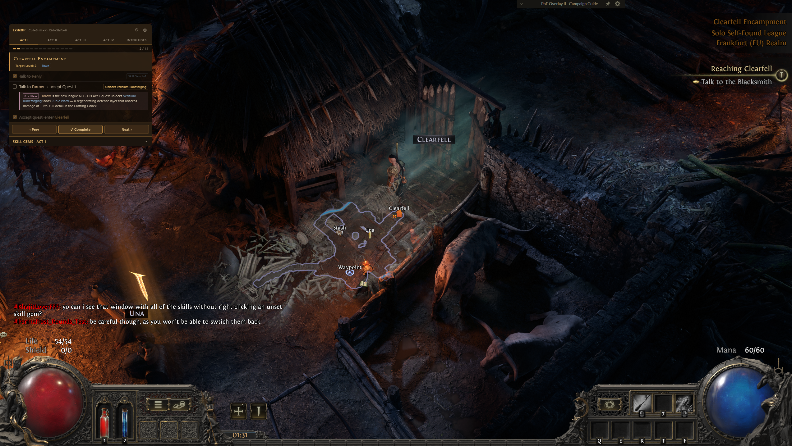
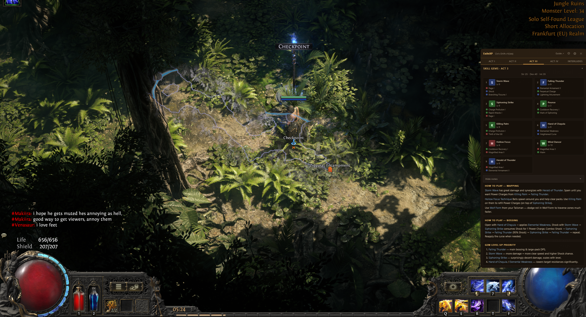

# ExileXP

A Path of Exile 2 leveling overlay for players who want to **optimize their league start campaign run but don't yet know every skip and shortcut by heart**.

Primarily a tailored **League Starter Monk** experience, heavily inspired by [**FGKorbyn21's monk leveling guide**](https://mobalytics.gg/poe-2/profile/fgkorbyn21/builds/0-5-league-start-monk-leveling-guide) (Mobalytics) and his [YouTube channel](https://www.youtube.com/@FGKorbyn21). The Standard profile is derived from [Domistae's poe2-leveling](https://domistae.github.io/poe2-leveling/) as a class-agnostic baseline.

If you main something other than Monk, **fork this repo and adapt** the profile data to your Mobalytics page / class of choice — the profile system was built specifically so a new class can be a single file under `src/data/profiles/`. PRs welcome.

<table align="center">
  <tr>
    <td align="center"></td>
    <td align="center"></td>
  </tr>
</table>

## Screenshots

<table>
  <tr>
    <td width="50%"></td>
    <td width="50%"></td>
  </tr>
  <tr>
    <td>Monk profile, Act 2 — tasks for the current zone with target level and league rewards.</td>
    <td>Per-act Skill Gems panel: skill + support gems with mapping / bossing notes.</td>
  </tr>
</table>

## Features

- **Class profiles** — Standard (generic) and Monk (Invoker / quarterstaff). Profiles are full rulesets — they don't stack with each other.
- **Curated leveling guide** for Acts 1–4, updated for the 0.5 patch (Verisium Runeforging, Fate of the Vaal, pressure pads, Dreadnought rework, etc.).
- **Per-act Skill Gems panel** (Monk) — skill + support gem layouts with mapping / bossing / level-up priority notes.
- **Zone autodetect** — tails `logs/Client.txt` and switches zones automatically as you play. 60+ internal area IDs ship pre-mapped; anything new is learned at runtime from a single manual click.
- **Click-through toggle** — let your clicks pass through to the game, with the toggle button itself always clickable.
- **Focus-aware visibility** — hides the overlay when Path of Exile 2 isn't the foreground app.
- **Per-profile progress**, base64 import/export, per-profile and global reset, "Catch up to current zone" bulk-mark.
- **Always-on-top** transparent overlay that resizes itself to fit its content.

## System requirements

- Windows 10 or 11 (x64)
- Path of Exile 2 (Steam or standalone)

## Install

1. Download the latest `ExileXP-<version>-portable.exe` from the [Releases](https://github.com/andreins/ExileXP/releases) page.
2. Double-click to run. **No install — no uninstaller — no registry footprint.** Settings live in `%APPDATA%/ExileXP/`.

> **Every release is built from CI.** The GitHub Actions run linked from each release page proves the .exe was built from the tagged commit, not someone's laptop. The release notes include the SHA-256 — you can verify locally with `Get-FileHash`.

> **First-run SmartScreen warning:** the .exe is not code-signed (paid certs cost $90+/yr — skipped to keep the project free). Windows will show "Windows protected your PC" on first launch. Click **More info → Run anyway**.

## Keyboard shortcuts

| Key | Action |
|---|---|
| `Ctrl + Shift + X` | Toggle click-through (overlay still visible, mouse passes through) |
| `Ctrl + Shift + H` | Show / hide the overlay (sticky — focus-tracking won't override) |

The on-screen ◎/⊘ button toggles click-through too — and it stays clickable even when click-through is on (hover it while click-through is enabled to temporarily wake the cursor).

## Profiles

- **Standard** — generic campaign guide derived from [Domistae's poe2-leveling](https://domistae.github.io/poe2-leveling/).
- **Monk** — Invoker / Bell quarterstaff. Curated tasks per zone, a Skill Gems panel per act (Acts 1–4 + Interludes), and class-specific notes (Frost Bomb timing, Siphoning Strike → Falling Thunder combos, Hollow Focus / Tempest Bell guidance, etc.). Built from [FGKorbyn21's monk leveling guide](https://mobalytics.gg/poe-2/profile/fgkorbyn21/builds/0-5-league-start-monk-leveling-guide) with permission-spirit attribution.

Switch profiles in **Settings** (the gear icon, top-right). Each profile has independent progress.

## Zone autodetect

In Settings → **Path of Exile 2 folder**, click **Browse…** and pick your PoE2 install folder (the one that contains `logs/`). ExileXP looks up `Client.txt` from there and tails it for `You have entered <zone>` / `Generating level area "..."` events. The overlay switches to the matching zone card automatically.

Default install locations (Steam + standalone, drives C–H) are auto-detected on first launch — most users don't need to touch this.

Toggle **Autodetect zone** off if you'd rather drive zones manually with the **Next / Prev** buttons.

## Forking / adapting for other classes

The profile system was built so adding a new class is small:

1. Drop a new file under `src/data/profiles/<class>.ts` exporting a `ProfileContent` (curated zone tasks/notes per zone — override only what differs from Standard).
2. Drop a `<class>-gems.ts` exporting `ProfileGems` (skill gem layouts per act).
3. Add an entry to `src/data/profiles/index.ts`.
4. Add the profile id to `ProfileId` in `src/types/guide.ts`.

That's it. Build, share, link your Mobalytics / community guide of choice in the Credits section.

## Development

```bash
npm install
npm run dev        # Vite renderer + Electron main, hot reload
```

Building from source:

```bash
npm run build      # Type-check + Vite production build + Electron main TS
npm run dist       # Produce release/ExileXP-<version>-portable.exe
```

## Potential directions

Not promises — directions the project *could* go if it gains traction. Mostly contributor bait:

- **In-app spell planner** — pick your skills + supports per act and have them render in the Gems panel instead of relying on a static curated list. Per-character, persisted alongside progress.
- **Auto-import from Mobalytics / community guides** — pull gem recommendations and zone notes automatically. Caveat: guide formats vary wildly across creators, so this would realistically be a best-effort import that you then hand-edit.
- **Built-in guide editor** — UI to author / tweak the leveling guide for a class with export so you can share it as a JSON file or PR it back upstream.

## Credits

- **[FGKorbyn21](https://www.youtube.com/@FGKorbyn21)** — the [Monk leveling guide](https://mobalytics.gg/poe-2/profile/fgkorbyn21/builds/0-5-league-start-monk-leveling-guide) on Mobalytics this project's Monk profile is heavily based on. All the route/gem decisions for Monk trace back to his work.
- **[Domistae / poe2-leveling](https://github.com/domistae/poe2-leveling)** — the class-agnostic Standard profile is modeled on this open-source guide (MIT-licensed).
- **[poe2db.tw](https://poe2db.tw/)** — used to map PoE2 internal area IDs to display names for the zone-autodetect feature.
- **Grinding Gear Games** — Path of Exile 2.

## License

[MIT](LICENSE) © 2026 andreins
